# Xpert Users Management (XUM)

Xpert Users Management (XUM) is a web-based application for managing users, software keys, and application statistics. It provides a simple interface for administrators to handle user accounts and track software license allocations.

## Features

- **User Management**: Create, read, update, and delete user accounts.
- **Key Management**: Assign and manage software keys for users.
- **Statistics**: View statistics and data visualizations related to users and keys.
- **Settings**: Configure application settings.

## Project Structure

```
/XUM
|-- /actions/           # Contains backend PHP scripts for processing forms (login, user creation, etc.).
|-- /assets/            # Contains CSS, JavaScript, images, and icons.
|-- /pages/             # Contains the content for different pages (users, keys, stats, settings).
|-- config.php          # Central configuration file (database credentials, etc.).
|-- connection.php      # Handles the database connection.
|-- index.php           # Main dashboard page, the application's entry point after login.
|-- login.php           # Login page.
|-- logout.php          # Handles user logout.
|-- new_user.php        # Page for creating a new user.
|-- README.md           # Project documentation.
```

## Setup

1.  **Prerequisites**: Make sure you have a web server (like Apache) with PHP and a database server (like SQL Server) running.
2.  **Database**: Create a database and import the necessary table structure.
3.  **Configuration**: Update `config.php` with your database credentials.
4.  **Run**: Open the application in your web browser.

## Screenshots

A preview of the main features of the application.

### Login and User Creation
| Login | Create Account |
| :---: | :---: |
| 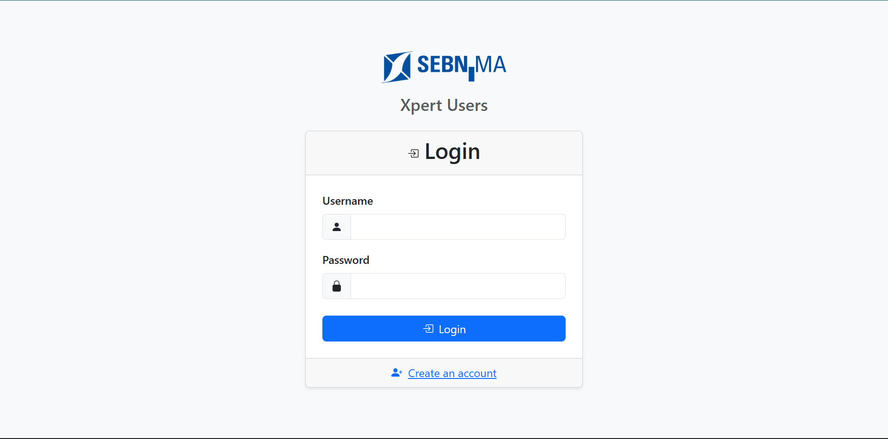 | 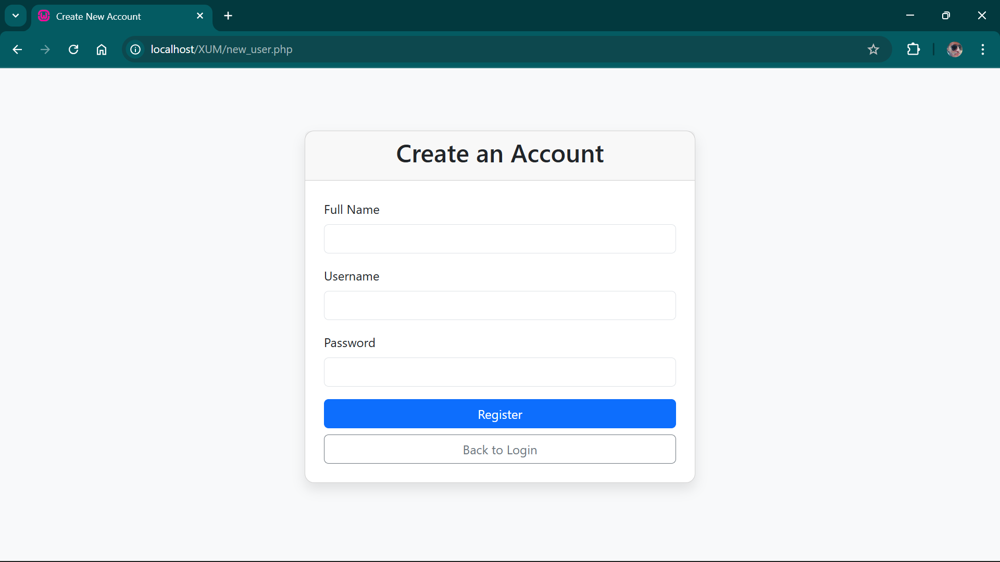 |

### User Management
| User List | Add User | Edit User |
| :---: | :---: | :---: |
| 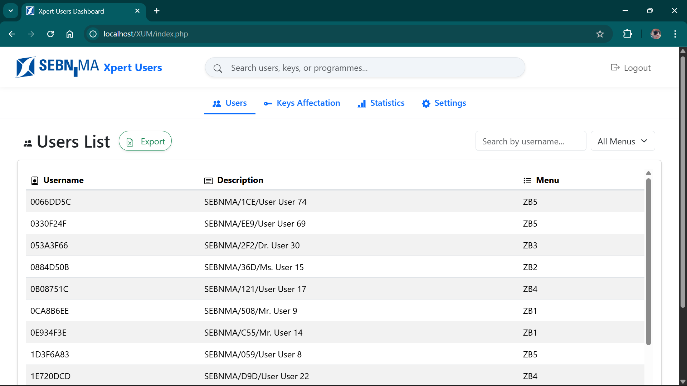 | 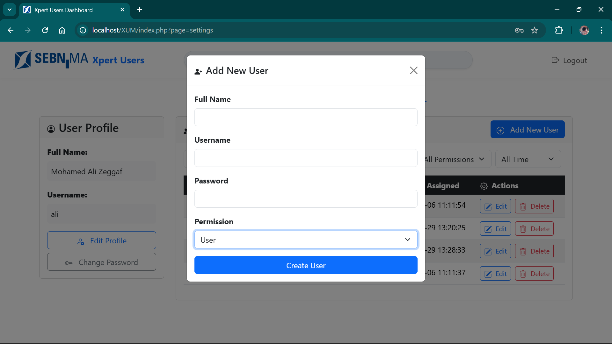 | 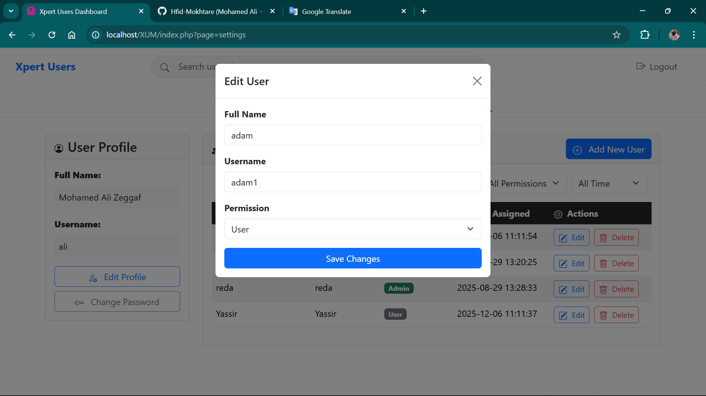 |

| Delete User Confirmation |
| :---: |
| 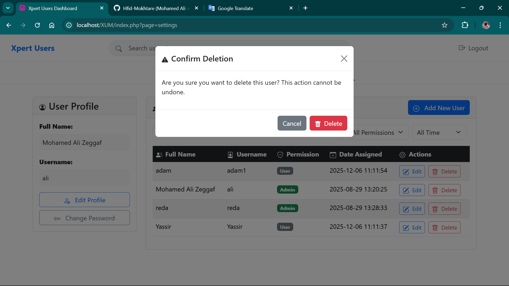 |

### Profile and Settings
| Edit Profile | Change Password | Settings |
| :---: | :---: | :---: |
| 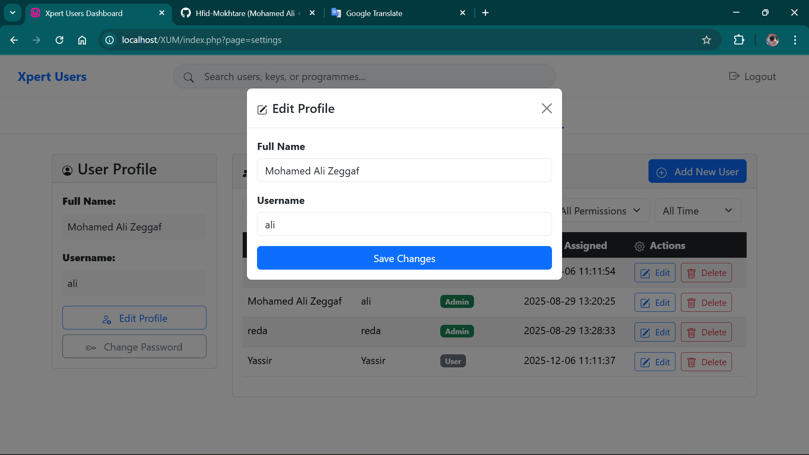 | 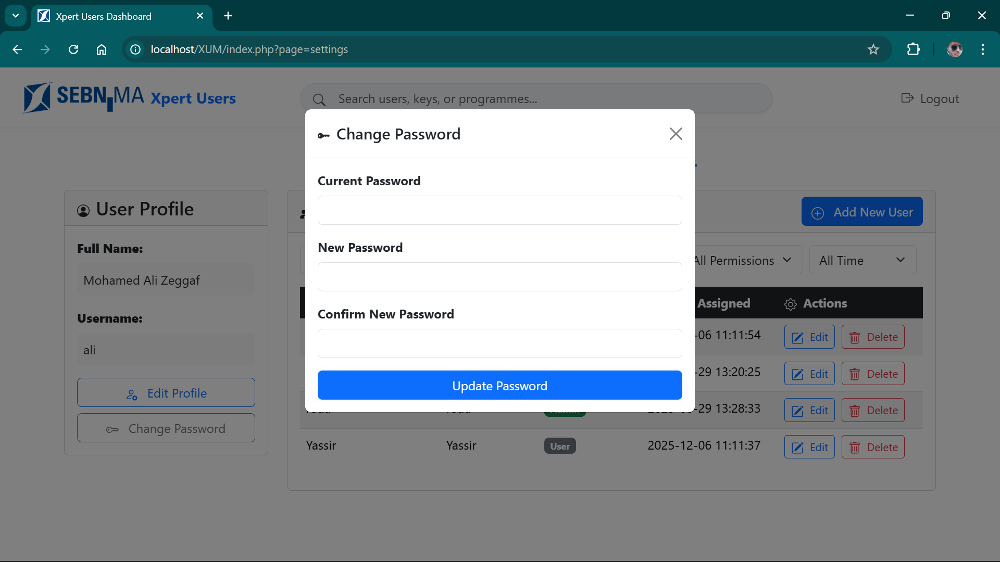 | 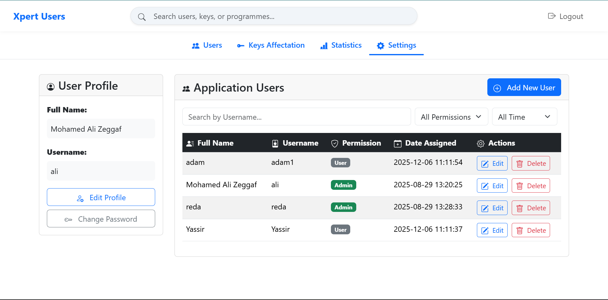 |

### Key Management
| Key Assignment 1 | Key Assignment 2 |
| :---: | :---: |
|  |  |

### Statistics
| Statistics Overview | Detailed Statistics |
| :---: | :---: |
| 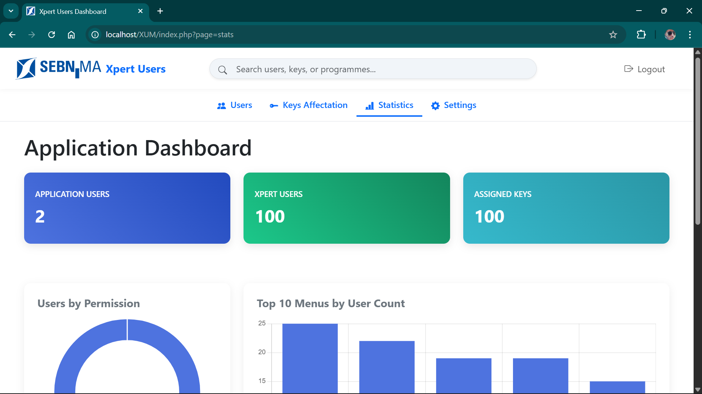 | 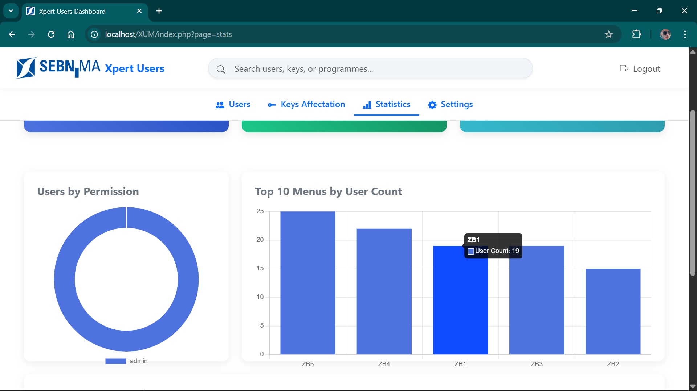 |
